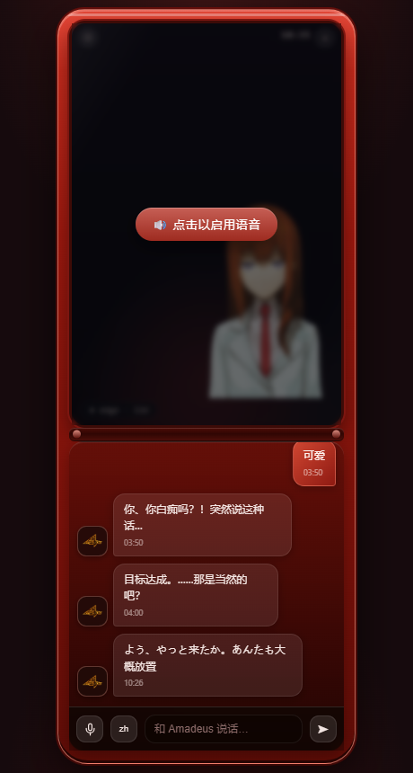

# AMADEUS for DSH

《命运石之门 0》Amadeus —— 牧濑红莉栖（Makise Kurisu）智能助手，DeepSeek Harness 插件。

红发翻盖手机里的她：**Live2D 立绘 + 日语语音 + 长期记忆 + 主动来电 + AI 聊天**。

## 🎬 效果预览与演示



- 演示视频（B 站）：https://www.bilibili.com/video/BV1CCb16rE3Q/

## 🚀 一键安装（Windows + PowerShell 5.1+，已装 DSH）

**方式一 · 在线一行命令**（PowerShell 或 CMD 粘贴）：

```powershell
powershell -ExecutionPolicy Bypass -c "irm https://raw.githubusercontent.com/yyxcnasd/amadeus-for-dsh/main/install-online.ps1 | iex"
```

按提示选择 TTS 通道后，**重启 DSH** 即对所有会话生效（含右侧栏 UI）。

**方式二 · 发行包**：[GitHub Releases](https://github.com/yyxcnasd/amadeus-for-dsh/releases) 下载 `Amadeus-for-DSH.zip` → 解压 → 双击 `Amadeus-OneClick.bat`。

**方式三 · 源码**：

```powershell
git clone https://github.com/yyxcnasd/amadeus-for-dsh.git
cd amadeus-for-dsh
.\install.ps1            # 交互菜单；或 .\install.ps1 -Channel edge / -Uninstall
```

> Edge TTS 通道需要 Python 3.9+（安装器自动 `pip install edge-tts`，失败可改用 VOICEVOX 公共 API 通道，无需 Python）。

## ⚙️ 安装位置

| 路径 | 内容 |
| --- | --- |
| `%DSH_HOME%\profiles\node_modules\amadeus-for-dsh\` | 插件本体（重装整体替换） |
| `%DSH_HOME%\amadeus\{config,memory,tmp}\` | 配置 / 长期记忆 / 临时音频（**升级不丢**） |
| `%DSH_HOME%\profiles\web\cordis.patch.yml` | 自动插入加载行（原文件备份 `.bak-*`） |

`%DSH_HOME%` 默认 `C:\Users\<你>\.dsh`，可用环境变量覆盖。卸载：`.\install.ps1 -Uninstall`（保留数据，且自动保持 `cordis.patch.yml` 为合法数组；手动删 insert 段后若文件变空，需恢复成一行 `[]`，否则 DSH 无法启动）

## ✨ 功能

- **红色翻盖手机 UI**：上屏 Live2D 红莉栖（呼吸/眨眼/说话嘴型/手势），下屏聊天；暗红主题。
- **实时语音**：默认 Edge TTS（免费开箱即用），可切 VOICEVOX / Aqua-TTS / OpenAI 兼容 / VOICEVOX 公共 API；默认「声线稳定」不自动切音色；按情感着色（12+ 情绪）。
- **词级口型同步**：TTS 响应携带逐词时间戳，嘴型按词包络 + 音频能量双驱动。
- **AI 聊天**：红莉栖人格（毒舌傲娇），日语语音 + 中文流式显示；可选独立 OpenAI 兼容 API。
- **长期记忆**：历史 + 事实抽取落盘，跨会话、跨重启。
- **主动来电 / 空闲闲聊**：复古铃声 + 震屏，间隔可调；长时间无互动自动开口。
- **事件播报 / 语音输入**：目标完成、子代理结束等日语播报；浏览器识别优先，降级 Whisper 后端 STT。

## 🛠 开发

```bash
node tools/build_static.mjs   # plugin/src/* → package/host.mjs + client.mjs
node tools/build_client.mjs   # esbuild 打包 client.js（含 React）
powershell -ExecutionPolicy Bypass -File tools/make_dist.ps1   # 生成发行 zip
```

- 动态源（会话内热更新）：`plugin/src/host.js`、`plugin/src/client.js`、`plugin/web/*`。
- 路径解析：静态包用 `import.meta.url` 定位安装目录；运行数据在 `%DSH_HOME%\amadeus`；开发可用 `AMADEUS_ROOT` 覆盖资源根。
- 架构与迭代记录见 `docs/`；TTS / Live2D 调研见 `research/`。

## 📁 目录

```
install.ps1 / install-online.ps1   # 通用安装器 + 在线引导
Amadeus-OneClick.bat               # 双击一键安装
package/                           # 静态插件包（DSH 按裸包名 amadeus-for-dsh 加载）
plugin/src + plugin/web/           # 插件源码 + 翻盖手机面板
tools/                             # TTS/STT python、构建脚本
assets/                            # Live2D 模型、图标、铃声
config/ persona/                   # 默认配置模板、人格提示词
docs/ research/                    # 设计文档、调研笔记
```

## 版权

角色形象/声音/台词归 MAGES./Nitroplus；Live2D 模型与语音素材为粉丝制作，仅供个人学习，禁止商用。