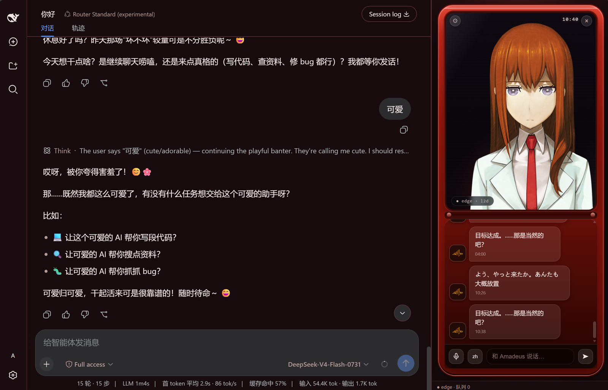

# AMADEUS for DSH

《命运石之门 0》Amadeus —— 牧濑红莉栖（Makise Kurisu）智能助手，DeepSeek Harness 插件。

红发翻盖手机里的她：**Live2D 立绘 + 日语语音 + 长期记忆 + 主动来电 + AI 聊天**。

## 🎬 效果预览与演示



- 演示视频（B 站）：https://www.bilibili.com/video/BV1CCb16rE3Q/

## 🚀 安装（与生态其它插件一致，dsh plugin add）

仓库根即 npm 包（`amadeus-for-dsh`，声明了 `dsh.bundle.patch`），因此安装方式和其他
GitHub 插件完全相同：

```powershell
# 安装到 desktop profile（DSH Desktop 自带 CLI 的默认 profile）
dsh plugin --profile desktop add github:yyxcnasd/amadeus-for-dsh

# 或安装到 web profile
dsh plugin --profile web add github:yyxcnasd/amadeus-for-dsh
```

`dsh plugin add` 会：
1. 用 pnpm 把包装进该 profile 的依赖（`profiles\<profile>\package.json`）；
2. 因为包内声明了 `dsh.bundle.patch`，自动把它加入该 profile 的 `dsh.profile.bundles`；
3. 重启 DSH 后，Amadeus 对该 profile 的所有会话自动加载（右侧栏出现翻盖手机面板）。

**零命令替代**：在你正在使用的 profile 上重启即可看到效果。**更新**：重跑同一条 `add` 命令即可（或 `dsh plugin --profile <p> update github:…`）。

### 老用户（v2.x 时代 `install.ps1`）迁移

v2.0 的 `install.ps1` 会把插件复制到 `profiles\node_modules\amadeus-for-dsh` 并在
`profiles\web\cordis.patch.yml` 手写加载行。新安装方式会自动清理这些旧痕迹
（幂等，原文件备份 `.bak-*`），避免重复加载冲突。

### 辅助脚本（可选）

- 在线一行命令（自动选 profile、初始化数据目录、可选 TTS 通道）：

  ```powershell
  powershell -ExecutionPolicy Bypass -c "irm https://raw.githubusercontent.com/yyxcnasd/amadeus-for-dsh/main/install-online.ps1 | iex"
  ```

- 本地发行包（zip）→ 解压 → 双击 `Amadeus-OneClick.bat` 或运行 `.\install.ps1 [-Profile desktop|web] [-Channel edge|quest]`

> pnpm 依赖：`dsh plugin` 需要 pnpm 在 PATH（DSH Desktop 自带；普通安装 `npm i -g pnpm` 或 `corepack enable`）。

## 🐧 Linux

插件本体是跨平台的（Node / 浏览器 / Python 均按平台解析可执行文件），
**PowerShell / .bat / install.ps1 等辅助工具仅面向 Windows**，Linux 下直接用 `dsh plugin add` 即可。

1. **安装插件**（DSH Web 模式）：
   ```bash
   dsh plugin --profile web add github:yyxcnasd/amadeus-for-dsh
   dsh web   # 重启 / 启动后右侧栏出现翻盖手机面板
   ```

2. **准备 curl**（TTS 备用通道需要）：
   ```bash
   # Arch: sudo pacman -S curl    Debian/Ubuntu: sudo apt install curl    Fedora: sudo dnf install curl
   ```

3. **准备 Python 与 edge-tts**（主 TTS 通道）。推荐使用 venv，避免污染系统 Python：
   ```bash
   python -m venv ~/.local/share/amadeus/venv
   ~/.local/share/amadeus/venv/bin/python -m pip install edge-tts
   export AMADEUS_PYTHON="$HOME/.local/share/amadeus/venv/bin/python"   # 可选：显式指定解释器
   ```
   插件解析 Python 的顺序：`AMADEUS_PYTHON` 环境变量 → `python` → `python3`（非 Windows）。
   若不想用 venv，也可以直接 `pip install --user edge-tts`。

4. **数据目录**：默认 `~/.dsh/amadeus`（`DSH_HOME` 优先于家目录），不会随启动目录漂移。
   配置 / 长期记忆 / 临时音频都在这里，重装不丢。

5. **可选环境变量**：
   | 变量 | 作用 |
   | --- | --- |
   | `DSH_HOME` | 覆盖 DSH 与 Amadeus 数据根目录（默认 `~/.dsh`） |
   | `AMADEUS_ROOT` | 覆盖插件资源根（一般只在开发时用） |
   | `AMADEUS_PYTHON` | 指定 Python 解释器路径（venv 等） |

6. **其他说明**：curl / python 名称按平台自动选择（Windows `curl.exe` / POSIX `curl`）；
   浏览器端行为与平台无关（Firefox / Chrome 均可）。
>
> Edge TTS 通道需要 Python 3.9+（脚本自动 `pip install edge-tts`，失败可改用 VOICEVOX 公共 API 通道，无需 Python）。

## ⚙️ 安装位置

| 路径 | 内容 |
| --- | --- |
| `%DSH_HOME%\profiles\<profile>\node_modules\amadeus-for-dsh\` | 插件本体（pnpm 管理，update 即升级） |
| `%DSH_HOME%\amadeus\{config,memory,tmp}\` | 配置 / 长期记忆 / 临时音频（**升级不丢**） |
| `%DSH_HOME%\profiles\<profile>\package.json` | `dependencies` + `dsh.profile.bundles`（dsh 自动维护） |

`%DSH_HOME%` 默认 `C:\Users\<你>\.dsh`，可用环境变量覆盖。
卸载：`dsh plugin --profile <p> remove amadeus-for-dsh`（保留数据目录）。

## ✨ 功能

- **红色翻盖手机 UI**：上屏 Live2D 红莉栖（呼吸/眨眼/说话嘴型/手势），下屏聊天；暗红主题。
- **实时语音**：默认 Edge TTS（免费开箱即用），可切 VOICEVOX / Aqua-TTS / OpenAI 兼容 / VOICEVOX 公共 API；默认「声线稳定」不自动切音色；按情感着色（12+ 情绪）。
- **词级口型同步**：TTS 响应携带逐词时间戳，嘴型按词包络 + 音频能量双驱动。
- **AI 聊天**：红莉栖人格（毒舌傲娇），日语语音 + 中文流式显示；可选独立 OpenAI 兼容 API。
- **长期记忆**：历史 + 事实抽取落盘，跨会话、跨重启。
- **主动来电 / 空闲闲聊**：复古铃声 + 震屏，间隔可调；长时间无互动自动开口。
- **事件播报 / 语音输入**：目标完成、后台任务结束（失败也会播报）等日语播报；浏览器识别优先，降级 Whisper 后端 STT。

## 🛠 开发

```bash
node tools/build_static.mjs   # plugin/src/* → 仓库根 host.mjs + client.mjs
node tools/build_client.mjs   # esbuild 打包 client.js（仅改 client 源码时需要）
powershell -ExecutionPolicy Bypass -File tools/make_dist.ps1   # 生成发行 zip
dsh plugin --profile desktop add link:.   # 本地开发安装（不改远程）
```

- 动态源（会话内热更新）：`plugin/src/host.js`、`plugin/src/client.js`、`plugin/web/*`。
- 路径解析：安装后 `host.mjs` 用 `import.meta.url` 定位包目录（即资源根）；运行数据在 `%DSH_HOME%\amadeus`；开发可用 `AMADEUS_ROOT` 覆盖资源根。
- 架构与迭代记录见 `docs/`；TTS / Live2D 调研见 `research/`。

## 📁 目录

```
package.json / host.mjs / client.js   # 仓库根即 npm 包（dsh plugin add 安装）
cordis.patch.yml                       # bundle 补丁层（dsh 自动纳入 profile.bundles）
install.ps1 / install-online.ps1       # 辅助安装器（内部即 dsh plugin add）
Amadeus-OneClick.bat                   # 发行包内的一键入口
plugin/src + plugin/web/               # 插件源码 + 翻盖手机面板
tools/                                 # TTS/STT python、构建脚本
assets/                                # Live2D 模型、图标、铃声
config/ persona/                       # 默认配置模板、人格提示词
docs/ research/                        # 设计文档、调研笔记
```

## 兼容性

- DSH（@deepseek-ai/dsh）0.1.x / DSH Desktop 2.0.x：已按新版 API 适配
  （`fs.writeText` 签名、`agent/error` 事件移除等），web 与 desktop profile 均可安装。
- 平台：Windows / Linux / macOS 均支持。可执行文件（curl / python）按平台解析，
  Python 可用 `AMADEUS_PYTHON` 指定（venv）；数据目录默认 `~/.dsh/amadeus`。
  PowerShell / .bat 辅助工具仅面向 Windows，Linux 直接用 `dsh plugin add`（见上方 🐧 Linux）。
- 旧版 DSH（2.0 时代）不再支持新安装方式时，请使用对应版本的发行包。

## 版权

角色形象/声音/台词归 MAGES./Nitroplus；Live2D 模型与语音素材为粉丝制作，仅供个人学习，禁止商用。